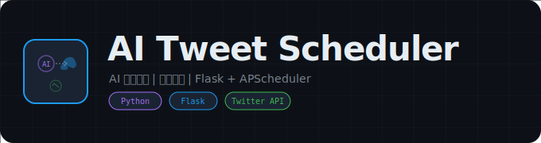

  

  # AI Tweet Scheduler

  **大模型交互定时发推特前后端系统**

  
  

---

## 概述

前后端分离的 AI 推特定时发布系统。后端集成大语言模型生成推文内容，前端提供可视化管理界面，支持定时发布、内容审核、多账号管理等功能。

## 功能特性

- **AI 内容生成** -- 集成大语言模型自动生成推文
- **定时发布** -- 支持定时和周期性发布计划
- **前端管理** -- React 构建的可视化管理面板
- **多账号** -- 支持多个 Twitter 账号管理

## 技术栈

| 层级 | 技术 |
|:---|:---|
| 前端 | React |
| 后端 | Python |
| AI | LLM API |
| 平台 | Twitter API |

## 免责声明

本项目仅供学习研究使用，请遵守 Twitter 平台规则。